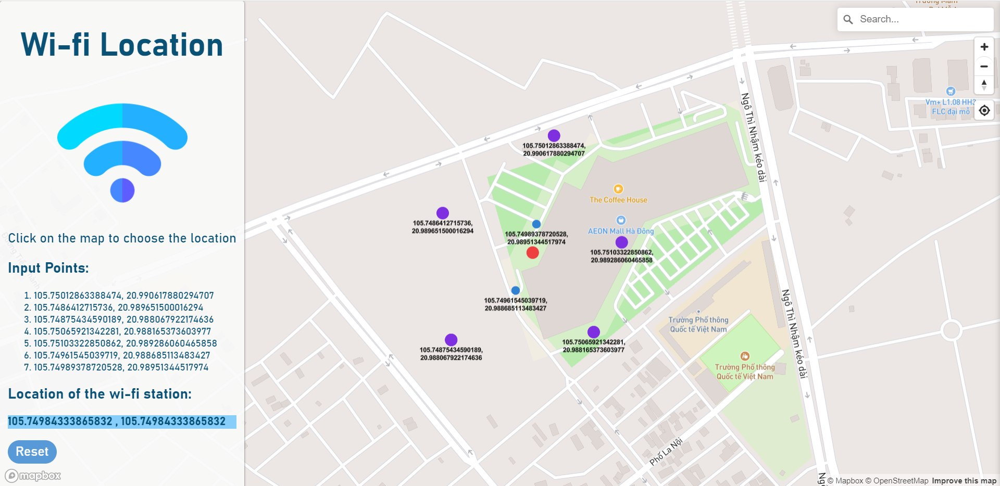

## GPU-ConvexHull
### Introduction
This is our **group project** in **Course MAT3148 - Parallel Computing**

#### About this project
- summary: **GPU-accelerated 2D Convex Hull Computation**
- topics covered: GPU, thread/warp scheduling
- tech stack: **CuPy (Cuda + Python), ReactJS**
- results:
    + implemented a **Python version** of the **GPU-utilized algorithm** in reference to the original with C++ programming
    + experimented with dataset of different sizes varying **from 100K to 20M** data points, reaching a significant **speedup of 4 times** at best in terms of excution time

---

### Overview

#### 1. Ideas
We followed the implementation described in the [_CudaChain_](https://springerplus.springeropen.com/articles/10.1186/s40064-016-2284-4) paper. The original source code was in C++ (obviously because we are using Cuda and GPU), which was a challenge for us since we have yet to learn C/C++. Therefore, we have made **an adaptation in Python**  using CuPy for getting familiar with *parallel computing* and *threads management*.

#### 2. Small Application
For a more **practical application** of this algorithm, we provided solution for a simplified facility location problem (FLP), in which we **suggest a location** for a new wifi (wireless/transceiver/etc. whatever you may want to call) station to be placed given a set of consumer points. The optimal location in this case is **the center of the convex hull** made by all the consumer points, assuming all complex constraints on geography/finance/etc. are removed.

